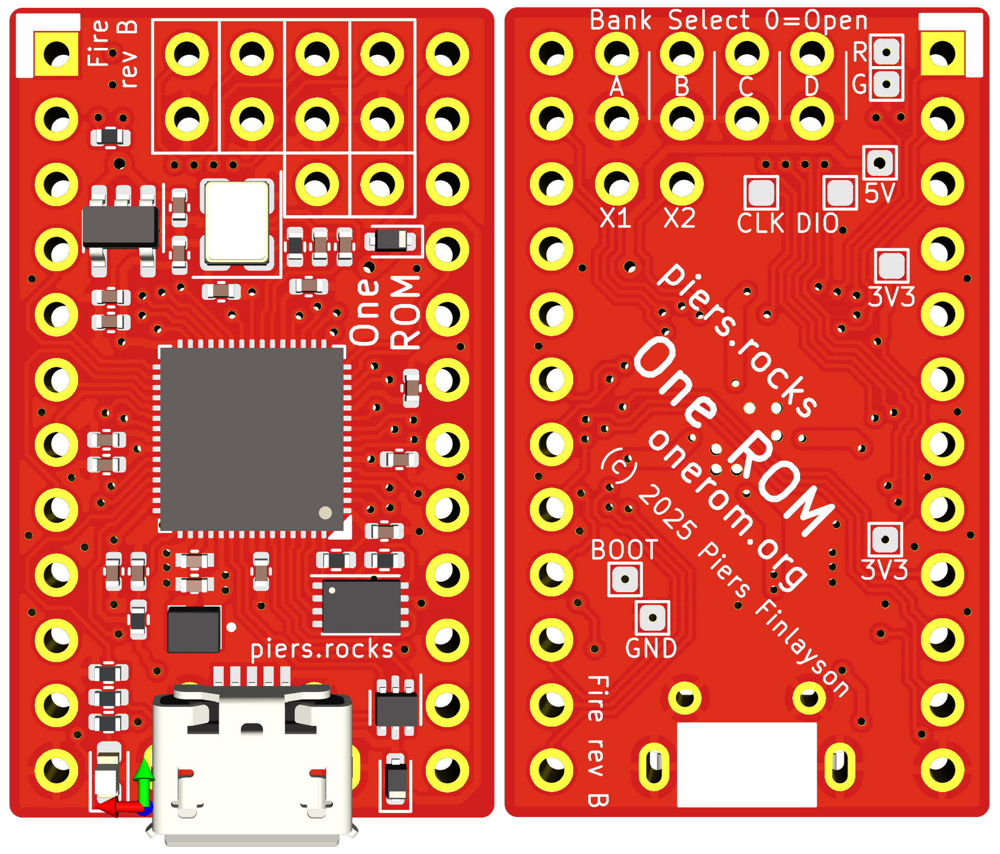

# One ROM Fire USB B 24 Pin 

**Unverified**: Significant redesign to add USB, not yet built and tested.  Significant risk of errors. 

Key changes from Fire rev A:
- Rotated RP2350 around by 180 degrees.
- Completely new address and data pin assignment, including moving D0-7 to GP0-7, and A0-15 to GP8-24.
- Slightly improved VREF supporting circuitry layout.
- Added micro-USB connector and VBUS detection.
- Removed programming header.
- Exposed 4th image select jumper.
- Test pads added on underside, including BOOTSEL/GND jump pads.

There is a single set of gerbers, one CPL/POS file and one BOM file.

  

## Contents

- [Schematic](one-rom-fire-usb-b-24-pin-schematic.pdf)
- [Fab Files](fab/)
- [KiCad Design Files](kicad/)
- [Errata](#errata)
- [Notes](#notes)
- [Changelog](#changelog)
- [BOM](#bom)

## Errata

## Notes

## Changelog

See above

## BOM

See fab files.